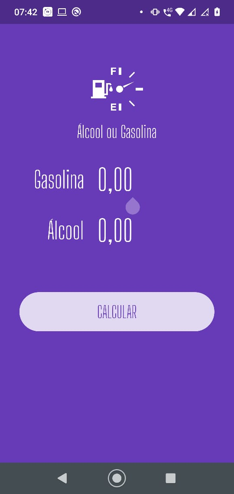
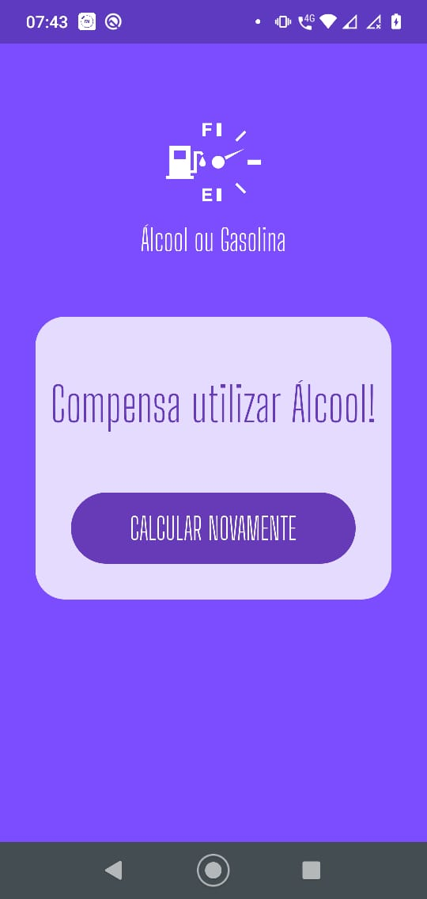

## O que é?
Curso de criação de um app focando na separação de componentes, animações e loading.

## Tecnologias
- Flutter
- Dart

## Balta.io Develop your career
[Curso - Flutter Apps: Alcool ou Gasolina](https://app.balta.io/courses/7192)

## Certificado

## App - Images

  
  

## IDE utilizada
[Visual Studio Code](https://code.visualstudio.com/)

## Extensões Visual Studio Code 
[Flutter](https://marketplace.visualstudio.com/items?itemName=Dart-Code.flutter) 
[Dart](https://marketplace.visualstudio.com/items?itemName=Dart-Code.dart-code) 

## Requisitos
[Flutter get started](https://flutter.dev/docs/get-started/install)